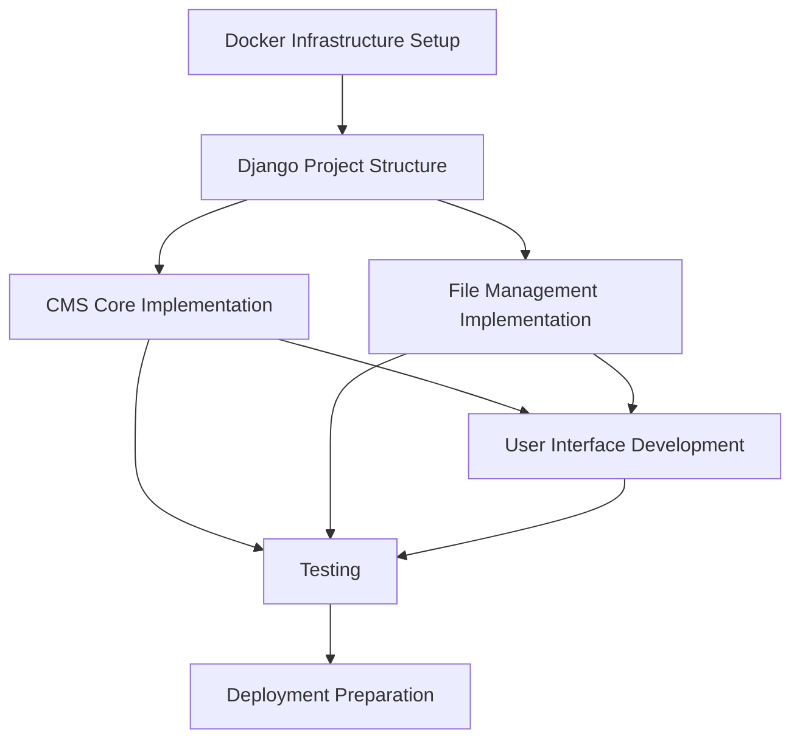

# NetCtrl Phase 1 Strategy and Task Instructions

This directory contains the strategic plan and detailed task instructions for Phase 1 of the NetCtrl project: a lightweight CMS with file management capabilities supporting files up to 5GB.

## Strategic Overview
- [Phase 1 CMS Strategic Plan](phase1_cms_strategy.md): Comprehensive strategic approach for implementing Phase 1

## Implementation Instructions

### Foundation Tasks
1. [Docker Infrastructure Setup](docker_infrastructure_instructions.txt): Setting up the containerized environment
2. [Django Project Structure](django_project_structure_instructions.txt): Creating the Django application foundation

### Core Functionality
3. [CMS Core Implementation](cms_core_implementation_instructions.txt): Implementing the content management features
4. [File Management Implementation](file_management_instructions.txt): Adding large file upload and management

### User Experience
5. [User Interface Development](user_interface_instructions.txt): Creating the mobile-first responsive UI with dark mode

### Quality Assurance and Deployment
6. [Testing Implementation](testing_instructions.txt): Comprehensive testing strategy
7. [Deployment Preparation](deployment_preparation_instructions.txt): Preparing for air-gapped deployment

## Implementation Flow

The implementation should follow the dependency chain established in the strategic plan:

## Task Dependencies

| Task | Dependencies |
|------|--------------|
| Docker Infrastructure Setup | None (foundation) |
| Django Project Structure | Docker Infrastructure Setup (partial) |
| CMS Core Implementation | Django Project Structure |
| File Management Implementation | Django Project Structure, Nginx Configuration |
| User Interface Development | Django Project Structure, CMS Core (partial), File Management (partial) |
| Testing | All implementation tasks |
| Deployment Preparation | All implementation and testing |

## Next Steps

1. Generate dependency tracker keys
2. Transition to Execution phase
3. Implement tasks following the established dependency chain
4. Update documentation as implementation progresses
