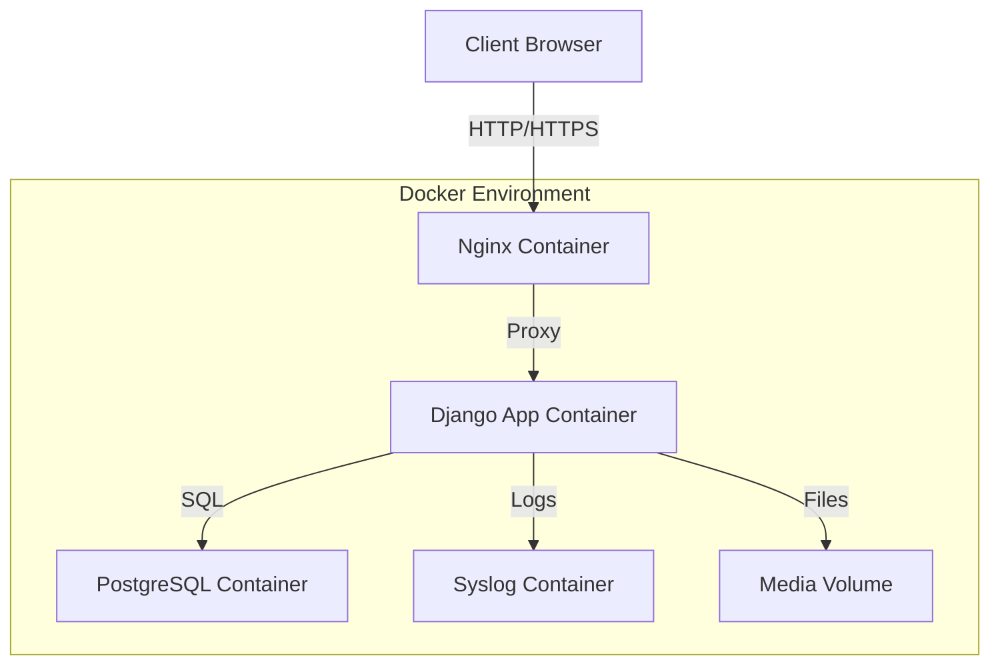
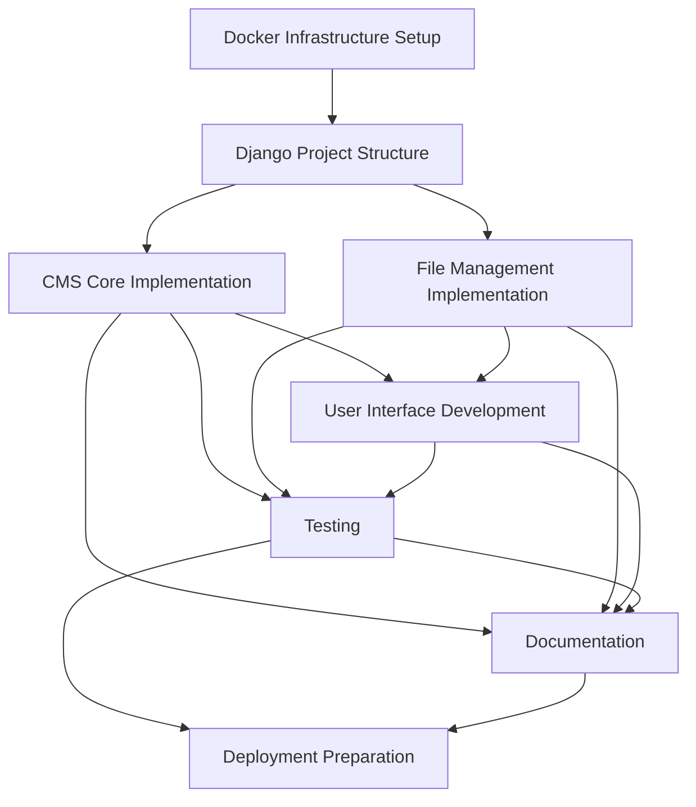

# Phase 1: CMS with File Management Strategic Plan

## Overview

This document outlines the strategic approach for implementing Phase 1 of the NetCtrl project: a lightweight CMS with file management capabilities supporting files up to 5GB.

## Architecture Components

## Implementation Tasks Breakdown

### 1. Docker Infrastructure Setup

**Priority: Critical Path (Foundation)**

#### Tasks:
1. Create `compose.yaml` with services (syslog, postgres, nginx, app)
2. Create Nginx configuration
3. Create Django Dockerfile
4. Configure volumes for persistent storage
5. Set up networks and service dependencies

#### Dependencies:
- None (this is the foundation)

### 2. Django Project Structure

**Priority: Critical Path (Foundation)**

#### Tasks:
1. Create Django project base structure
2. Configure settings for PostgreSQL connection
3. Configure settings for Syslog integration
4. Configure static and media file settings
5. Set up authentication with local user accounts
6. Configure Django for production deployment
7. Create data models

#### Dependencies:
- Docker Infrastructure Setup (partial)

### 3. CMS Core Implementation

**Priority: High (Core Functionality)**

#### Tasks:
1. Create Document model for CMS content
2. Implement CRUD views for Documents
3. Create templates for Document management
4. Implement text editor for content creation
5. Implement user management views
6. Create dashboard view

#### Dependencies:
- Django Project Structure

### 4. File Management Implementation

**Priority: High (Core Functionality)**

#### Tasks:
1. Integrate django-chunked-upload package
2. Create File model for uploaded files
3. Implement file upload views
4. Create file listing and download views
5. Implement file metadata management
6. Configure Nginx for large file uploads

#### Dependencies:
- Django Project Structure
- Nginx configuration for large files

### 5. User Interface Development

**Priority: High (Critical UX)**

#### Tasks:
1. Integrate Bootstrap 5.3 locally
2. Implement responsive, mobile-first design
3. Create dark mode toggle functionality
4. Design and implement navigation structure
5. Create UI components for CMS and file management
6. Optimize UI for mobile devices

#### Dependencies:
- Django Project Structure
- CMS Core Implementation (partial)
- File Management Implementation (partial)

### 6. Testing

**Priority: High (Quality Assurance)**

#### Tasks:
1. Create unit tests for models
2. Create integration tests for views
3. Test file upload functionality with various file sizes
4. Test mobile responsiveness
5. Test dark mode toggle
6. Performance testing for large files

#### Dependencies:
- All implementation tasks

### 7. Documentation

**Priority: Medium**

#### Tasks:
1. Document deployment process
2. Create user manual
3. Document API endpoints
4. Document database schema
5. Create administrator guide

#### Dependencies:
- All implementation tasks

### 8. Deployment Preparation

**Priority: Medium-High**

#### Tasks:
1. Create production configuration
2. Prepare Debian deployment package
3. Create deployment scripts
4. Test deployment in isolated environment
5. Document air-gapped deployment procedure

#### Dependencies:
- All implementation and testing tasks

## Detailed Task Dependencies

## Implementation Approach

### Development Phases

1. **Infrastructure Phase**
   - Set up all Docker components
   - Configure base Django project
   - Ensure database and logging work correctly

2. **Core Functionality Phase**
   - Implement CMS capabilities
   - Implement file upload/download functionality
   - Create authentication and user management

3. **UI/UX Phase**
   - Implement responsive design
   - Create dark mode
   - Optimize mobile experience

4. **Testing and Refinement Phase**
   - Test all functionality
   - Optimize performance
   - Fix issues

5. **Deployment Preparation Phase**
   - Prepare for air-gapped deployment
   - Document all procedures

### Risk Assessment

| Risk | Probability | Impact | Mitigation |
|------|------------|--------|------------|
| Large file upload failures | Medium | High | Use chunked upload, extensive testing |
| Mobile UI issues | Medium | Medium | Mobile-first design, thorough testing on various devices |
| Database performance issues | Low | High | Optimize queries, index properly |
| Air-gapped deployment issues | Medium | High | Test deployment in isolated environment |
| Django-PostgreSQL integration issues | Low | Medium | Follow best practices, test thoroughly |

## Success Criteria

Phase 1 will be considered successful when:

1. Users can create, edit, and delete CMS content
2. Files up to 5GB can be uploaded, managed, and downloaded
3. The interface is fully responsive and works on mobile devices
4. Dark mode toggle functions correctly
5. All components run properly in Docker containers
6. The system can be deployed in an air-gapped environment
7. Documentation is complete and comprehensive

## Next Steps

1. Create detailed instruction files for each major task
2. Update dependency tracker with file-level dependencies
3. Implement the infrastructure phase
4. Review and update this strategy as development progresses
