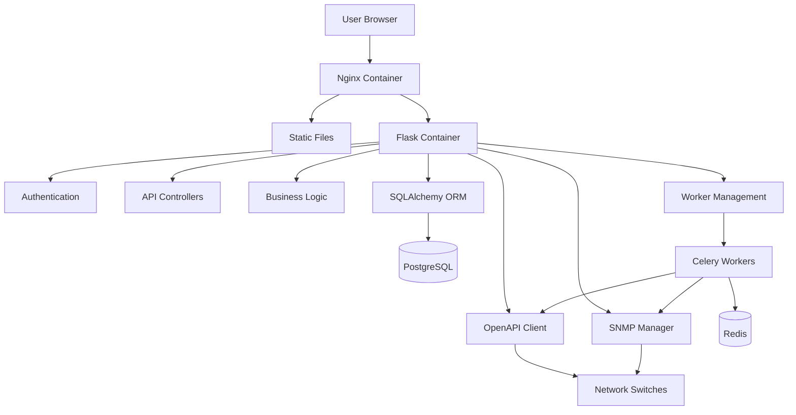
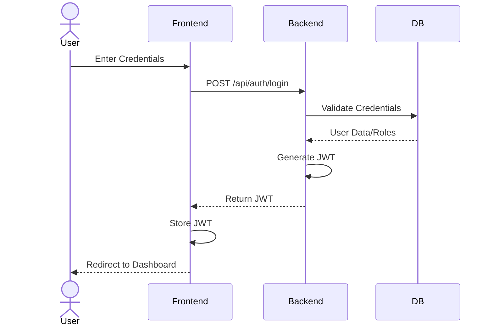
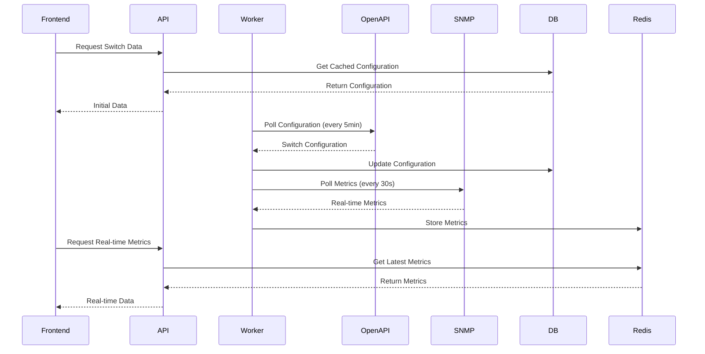

# System Patterns

## Architecture
The application follows a containerized microservices architecture with four primary Docker containers:

1. **Flask App Container**
   - Core backend services
   - API endpoints and REST controllers
   - Business logic implementation
   - Worker processes for switch polling
   - OpenAPI client integration for M4300 switches
   - SNMP integration for metrics collection
   - Authentication and authorization handling
   - CMS content management

2. **PostgreSQL Container**
   - Persistent data storage
   - Stores user information and authentication data
   - CMS content and revision history
   - Switch configuration data in JSON format
   - File metadata tracking
   - Maintains relationships between entities

3. **Redis Container**
   - Near-realtime SNMP metrics storage
   - Caching layer for frequently accessed data
   - Worker task queue for Celery
   - Session management (optional)
   - Pub/Sub for real-time updates (optional)
   - Optional persistence for airgapped recovery

4. **Nginx Container**
   - Reverse proxy for the Flask application
   - Static file serving for frontend assets
   - API request forwarding to backend
   - SSL termination
   - Request rate limiting
   - HTTP caching
   - Load balancing (future scalability)

## Data Flow

### Primary User Flow
```
User → Nginx → Flask → PostgreSQL/Redis
                ↓
         Worker Processes
                ↓
            Switches
```

### Detailed Component Interaction


### Authentication Flow


### Switch Management Flow


## API Integration

### Frontend-Backend Integration

- **Centralized API Service**: Frontend uses a centralized API service (`frontend/src/services/api.js`) that encapsulates all backend communication, providing a clean interface for components to interact with backend data.

- **Authentication Flow**: 
  - JWT tokens are automatically injected into requests via an Axios interceptor
  - Unauthorized responses (401) trigger automatic redirection to login
  - Token management handled transparently from components

- **API Modularity**:
  - Service organized into logical domains (auth, switches, content, users, dashboard)
  - Each domain contains related API methods with consistent patterns
  - Methods return promises for async handling

- **Data Transformation**:
  - Incoming API data is transformed to frontend-friendly formats
  - Component-specific data structures are created from API responses
  - Backend date formats are converted to user-friendly displays

- **Error Handling Strategy**:
  - Centralized error interception and processing
  - Consistent error presentation across components
  - Fallback data patterns for graceful degradation

### CMS Integration

- **Content Retrieval and Display**:
  - Content listing with pagination, filtering, and search
  - Detailed content view with revision history
  - File attachment handling with appropriate MIME types
  - Content status management (draft, published, archived)

- **Content Editing**:
  - Form validation before submission
  - File upload progress tracking
  - Draft auto-saving capabilities
  - Unsaved changes protection
  - Tab-based content organization

### Dashboard Integration

- **Concurrent API Requests**:
  - Parallel fetching of switch and content statistics
  - Promise.all pattern for efficient data loading
  - Separate error handling for each data source

- **Metrics Visualization**:
  - Real-time data display with auto-refresh
  - Status-based visual indicators
  - Error states with graceful fallbacks

### Switch Management Integration

- **OpenAPI Client Abstraction**:
  - Backend abstracts OpenAPI client complexity
  - Frontend works with simplified data models
  - Backend handles data normalization and transformation

- **Real-time Updates**:
  - Periodic polling for fresh switch data
  - Smart caching to reduce network overhead
  - Optimistic UI updates for responsive experience

### OpenAPI Client Integration

- **Client Generation**: The OpenAPI client for the M4300 switch API is pre-generated (`openapi_client` directory).
- **API Abstraction**: Backend facades over the OpenAPI client to provide simplified interfaces.
- **Response Normalization**: Switch data is normalized to consistent formats by the backend before storing or sending to frontend.

## Key Technical Decisions

1. **Worker Processes**
   - Celery workers for asynchronous switch polling
   - Redis as message broker for task queue
   - Managed task queue for distributed processing
   - Configured to balance load across switches (10 switches per worker)
   - Scheduled tasks for periodic data collection
   - Error handling and retry mechanisms
   - Task prioritization for critical operations

2. **API Design**
   - RESTful API endpoints with consistent naming conventions
   - OpenAPI integration for M4300 switches using generated client
   - SNMP integration for near-realtime metrics
   - API versioning for future compatibility
   - Response caching for improved performance
   - Standardized error responses
   - Pagination for large data sets
   - Filtering and sorting capabilities

3. **Authentication**
   - JWT-based authentication with token expiration and refresh
   - Role-based access control (Admin, Manager, User, Read-only)
   - Permission-based authorization for fine-grained control
   - Air-gapped registration workflow with admin approval
   - Password policies and secure credential storage
   - Session management
   - Audit logging for security events

4. **Database Schema**
   - Users and roles tables with many-to-many relationships
   - CMS content storage with revision history
   - Switch configuration JSON storage with historical tracking
   - File metadata tracking for uploaded content
   - Optimized indexes for common queries
   - Foreign key constraints for data integrity
   - Soft delete for important records

5. **SSL Handling**
   - Temporary workaround for self-signed certificates
   - Suppression of insecure connection warnings
   - Documentation of security implications
   - Future roadmap for proper certificate management

## Deployment Strategy

- Docker Compose 3.9 for modern container orchestration
- Named services, volumes, and networks for clarity
- Explicit container resource limits (CPU and memory)
- Comprehensive health checks for all services
- Condition-based service dependencies (service_healthy)
- Read-only volume mounts where possible for security
- Alpine-based images where appropriate for smaller footprint
- Redis configured with password authentication and memory limits
- Environment variables for flexible configuration
- Self-contained dependencies for air-gapped operation
- Explicit container naming for easier management
- Enhanced restart policies for improved uptime
- Volume backup capabilities for data protection
- Proper service shutdown order for data integrity

## Repository Structure

```
netctrl/
├── docker-compose.yml       # Main container orchestration
├── .env                     # Environment variables
├── .gitignore               # Git ignore patterns
├── README.md                # Project documentation
├── cline_docs/              # Memory bank documentation
├── docs/                    # Project specifications
├── flask_app/               # Backend application
│   ├── app/                 # Application code
│   │   ├── __init__.py      # App initialization
│   │   ├── models/          # Database models
│   │   ├── api/             # API endpoints
│   │   ├── auth/            # Authentication
│   │   ├── cms/             # CMS functionality
│   │   ├── switch/          # Switch management
│   │   ├── worker/          # Worker processes
│   │   └── utils/           # Utility functions
│   ├── tests/               # Backend tests
│   ├── Dockerfile           # Flask container build
│   └── requirements.txt     # Python dependencies
├── frontend/                # React application
│   ├── public/              # Static assets
│   ├── src/                 # React source code
│   │   ├── components/      # UI components
│   │   ├── pages/           # Page layouts
│   │   ├── services/        # API services
│   │   ├── store/           # State management
│   │   └── utils/           # Frontend utilities
│   ├── Dockerfile           # Frontend container build
│   ├── package.json         # Node.js dependencies
│   └── tests/               # Frontend tests
├── nginx/                   # Nginx configuration
│   ├── Dockerfile           # Nginx container build
│   └── conf/                # Nginx config files
├── postgres/                # PostgreSQL configuration
│   ├── init/                # DB initialization scripts
│   └── Dockerfile           # PostgreSQL customization
└── openapi_client/          # OpenAPI generated client
```

## Error Handling Strategy

1. **API Error Responses**
   - Standardized error format across all endpoints
   - HTTP status codes with meaningful error messages
   - Detailed error information for debugging (dev environment only)
   - Error categorization for frontend handling

2. **Worker Error Management**
   - Task retry mechanism with exponential backoff
   - Dead letter queue for failed tasks
   - Alerting for critical failures
   - Graceful degradation when switches are unreachable

3. **Frontend Error Handling**
   - Global error boundary components
   - Offline operation capabilities
   - User-friendly error messages
   - Automatic retry for transient network issues

## Testing Architecture

1. **Backend Testing**
   - Unit tests for business logic
   - API integration tests
   - Database model tests
   - Worker process tests
   - Mock objects for external dependencies

2. **Frontend Testing**
   - Component unit tests
   - Integration tests for complex interactions
   - End-to-end testing for critical flows
   - Accessibility testing

3. **CI/CD Considerations**
   - Automated test suite execution
   - Docker build verification
   - Static code analysis
   - Security scanning

## Version Control Patterns

1. **File Tracking**
   - All new files should be explicitly added to git when they are created so they are tracked
   - Use `git add [filename]` when creating new files
   - Ensure configuration files, documentation, and code are properly tracked
   - Add files before committing changes to maintain complete project history
