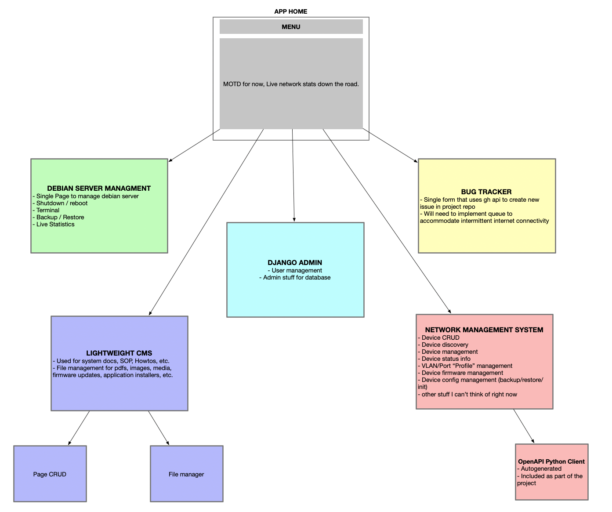

# NetCtrl Architecture

## Overview
NetCtrl is a Django-based network device management system designed with a modular architecture that separates concerns between user interface, device management, and network operations.

## Core Components

### 1. Web Interface Layer
- **Dashboard (netdash)**
  - User authentication and authorization
  - System-wide status monitoring
  - Activity logging and notifications
  - User approval workflow

- **Device Management (netdevices)**
  - Device inventory management
  - Status monitoring interface
  - Configuration management UI
  - Device grouping and tagging

- **Configuration Management (netconfig)**
  - Configuration template management
  - Version control interface
  - Deployment workflow
  - Backup management

### 2. Business Logic Layer

#### Authentication & Authorization
- Custom User model with approval system
- Role-based access control
- Session management
- Security middleware

#### Device Management
- Device discovery
- Status monitoring
- Configuration validation
- Inventory tracking
- Device grouping logic

#### Configuration Management
- Template versioning
- Configuration generation
- Deployment scheduling
- Backup coordination
- Rollback management

### 3. Data Layer

#### Database Schema
- User and permission data
- Device inventory
- Configuration templates
- Deployment history
- System logs

#### File Storage
- Configuration backups
- Template storage
- Audit logs
- User uploads

### 4. Network Integration Layer

#### Device Communication
- SSH/Telnet connectivity
- SNMP monitoring
- REST API integration
- WebSocket updates

#### Protocol Support
- Network configuration protocols
- Monitoring protocols
- Management protocols
- Backup protocols

## Security Architecture

### Authentication Flow
1. User registration
2. Admin approval process
3. Role assignment
4. Permission management

### Authorization Layers
1. Authentication check
2. User approval verification
3. Role-based access control
4. Object-level permissions

### Security Measures
- CSRF protection
- Session security
- Input validation
- SQL injection prevention
- XSS protection

## Data Flow

### User Operations
1. User Interface Layer
   - Web forms
   - API endpoints
   - WebSocket connections

2. Business Logic Layer
   - Request validation
   - Business rule enforcement
   - Operation orchestration

3. Data Layer
   - Data persistence
   - File storage
   - Cache management

### Device Operations
1. User Request
   - Configuration changes
   - Status requests
   - Backup operations

2. Operation Processing
   - Request validation
   - Task queuing
   - Operation scheduling

3. Network Execution
   - Device communication
   - Command execution
   - Response handling

## Scalability Design

### Horizontal Scaling
- Load balancer ready
- Stateless application servers
- Distributed caching support
- Session management

### Vertical Scaling
- Database optimization
- Query caching
- Background task processing
- Resource management

## Monitoring & Logging

### System Monitoring
- Application metrics
- Performance monitoring
- Resource utilization
- Error tracking

### Network Monitoring
- Device status
- Connection health
- Protocol performance
- Bandwidth utilization

### Audit Logging
- User actions
- Configuration changes
- System events
- Security incidents

## Deployment Architecture

### Development Environment
- Local development setup
- Testing environment
- CI/CD integration
- Code quality tools

### Production Environment
- High availability setup
- Load balancing
- Backup systems
- Monitoring systems

## Integration Points

### External Systems
- Authentication services
- Monitoring systems
- Backup services
- Notification systems

### APIs
- REST API endpoints
- WebSocket services
- Event webhooks
- Integration interfaces

## Future Considerations

### Scalability
- Microservices migration path
- Container orchestration
- Cloud deployment options
- Performance optimization

### Features
- Automated network discovery
- AI-powered configuration suggestions
- Advanced analytics
- Predictive maintenance

### Integration
- Third-party tool integration
- Additional protocol support
- Cloud service integration
- Automation framework
