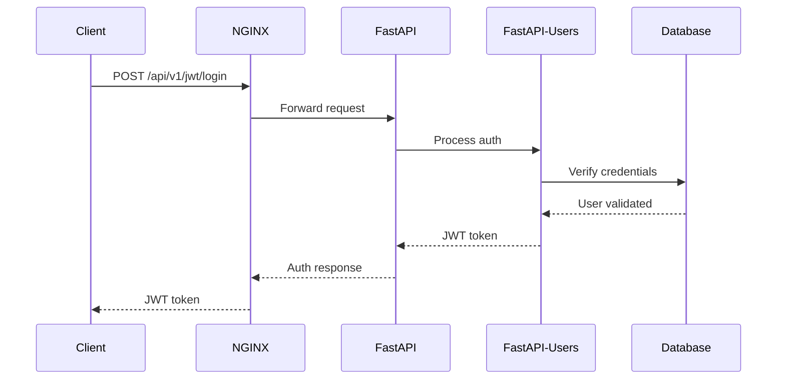

# Authentication System Implementation Details

This document provides the technical implementation details for the Authentication System Refactoring Plan. It includes specific code changes, file modifications, and testing procedures.

## Core Authentication Components

### 1. Standard Authentication Flow (to preserve)



### 2. Role-Based Access Controls (to preserve)

The existing role-based access control should be maintained through the standard FastAPI-Users dependency system.

## Phase 1: File-by-File Implementation Details

### 1. Modify `app/main.py`

**Current Implementation (Problematic)**:
```python
# Include API routers
app.include_router(auth.router, prefix=f"{settings.API_V1_STR}")
app.include_router(roles.router, prefix=f"{settings.API_V1_STR}")
app.include_router(users.router, prefix=f"{settings.API_V1_STR}")

# Add custom authentication endpoints
app.include_router(
    custom_auth.router,
    prefix=f"{settings.API_V1_STR}/jwt",
    tags=["auth"]
)
```

**Modified Implementation**:
```python
# Include API routers
app.include_router(auth.router, prefix=f"{settings.API_V1_STR}")
app.include_router(roles.router, prefix=f"{settings.API_V1_STR}")
app.include_router(users.router, prefix=f"{settings.API_V1_STR}")

# REMOVED: Custom authentication router
# Custom router removed to avoid conflict with FastAPI-Users router
```

### 2. Simplify `src/nginx/conf/default.conf`

**Current Implementation (Overly Complex)**:
```nginx
# Special case handling for login endpoint
location = /api/v1/jwt/login {
    # Buffer the client request body
    client_body_buffer_size 16k;

    # Save entire request body to a file
    client_body_in_file_only on;

    # Log request details
    log_subrequest on;

    # We need to capture the request body for logging but also pass it to backend
    # So we use mirror to copy the request for logging
    mirror /debug_mirror;

    # Actual proxying to backend
    proxy_pass http://backend:8000/api/v1/jwt/login;
    proxy_set_header Host $host;
    proxy_set_header X-Real-IP $remote_addr;
    proxy_set_header X-Forwarded-For $proxy_add_x_forwarded_for;
    proxy_set_header X-Forwarded-Proto $scheme;
}

# Mirror endpoint for logging (doesn't actually respond to the client)
location = /debug_mirror {
    # This will not return any response to the client
    internal;

    # Log the details for debugging
    access_log /var/log/nginx/auth_requests.log debug_log;

    # Return 200 to mirror but it doesn't affect the original request
    return 200;
}

# All other API requests
location /api/ {
    proxy_pass http://backend:8000;
    proxy_set_header Host $host;
    proxy_set_header X-Real-IP $remote_addr;
    proxy_set_header X-Forwarded-For $proxy_add_x_forwarded_for;
    proxy_set_header X-Forwarded-Proto $scheme;
}
```

**Simplified Implementation**:
```nginx
# Unified API request handling
location /api/ {
    proxy_pass http://backend:8000;
    proxy_set_header Host $host;
    proxy_set_header X-Real-IP $remote_addr;
    proxy_set_header X-Forwarded-For $proxy_add_x_forwarded_for;
    proxy_set_header X-Forwarded-Proto $scheme;
    
    # Set reasonable buffer size without special handling
    client_max_body_size 2M;
    
    # Standard logging
    access_log /var/log/nginx/api_access.log;
}
```

### 3. Remove `app/api/routes/custom_auth.py`

This file should be completely removed as it duplicates authentication functionality already provided by FastAPI-Users.

### 4. Cleanup Debug Scripts

Create one consolidated authentication diagnostics tool and remove other redundant scripts:

**Scripts to Remove**:
- `debug_login.py`
- `test_login.py`
- `test_login_requests.py`
- `analyze_login_requests.py`
- `auth_troubleshooter.py`
- `fix_auth_path.py`
- `direct_login_endpoint.py`
- `enable_nginx_debug_logging.sh`

**Script to Keep**: `reset_admin_password.py` for admin recovery

**New Consolidated Diagnostic Tool**: Create `auth_diagnostics.py` with essential diagnostics:

```python
#!/usr/bin/env python
"""
Authentication Diagnostics Tool for NetCtrl CMS

This consolidated tool provides essential diagnostics for authentication issues.
"""
import asyncio
import sys
import os
from sqlalchemy.future import select
from fastapi_users.password import PasswordHelper

# Add parent directory to Python path
script_dir = os.path.dirname(os.path.abspath(__file__))
parent_dir = os.path.dirname(script_dir)
sys.path.insert(0, parent_dir)

# Import application modules
from app.db.session import AsyncSessionLocal
from app.models.user import User
from app.core.config import settings

async def check_database_user(username=None):
    """Check if the specified user exists in the database"""
    username = username or settings.FIRST_SUPERUSER_USERNAME
    
    print(f"Checking database for user: {username}")
    async with AsyncSessionLocal() as session:
        result = await session.execute(
            select(User).where(User.username == username)
        )
        user = result.scalars().first()
        
        if not user:
            print(f"❌ User '{username}' not found in database")
            return False
        
        print(f"✅ Found user: {username}")
        print(f"   ID: {user.id}")
        print(f"   Role: {user.role}")
        print(f"   Active: {user.is_active}")
        print(f"   Superuser: {user.is_superuser}")
        return True

async def verify_password(username, password):
    """Check if the password is valid for the specified user"""
    async with AsyncSessionLocal() as session:
        result = await session.execute(
            select(User).where(User.username == username)
        )
        user = result.scalars().first()
        
        if not user:
            print(f"❌ User '{username}' not found")
            return False
        
        # Verify password
        password_helper = PasswordHelper()
        is_valid, _ = password_helper.verify_and_update(
            password, user.hashed_password
        )
        
        if is_valid:
            print(f"✅ Password is correct for user '{username}'")
        else:
            print(f"❌ Password verification failed for user '{username}'")
        
        return is_valid

async def print_auth_examples():
    """Print example curl commands for authentication testing"""
    username = settings.FIRST_SUPERUSER_USERNAME
    password = settings.FIRST_SUPERUSER_PASSWORD
    
    print("\n📋 Example Authentication Commands:")
    print(f"1. Standard login:")
    print(f"   curl -v -X POST 'http://localhost/api/v1/jwt/login' \\")
    print(f"     -H 'Content-Type: application/x-www-form-urlencoded' \\")
    print(f"     -d 'username={username}&password={password}&grant_type=password'")
    
    print(f"\n2. Using JSON format (should fail, testing handling):")
    print(f"   curl -v -X POST 'http://localhost/api/v1/jwt/login' \\")
    print(f"     -H 'Content-Type: application/json' \\")
    print(f"     -d '{{\"username\":\"{username}\",\"password\":\"{password}\"}}'")

async def main():
    if len(sys.argv) < 2:
        print("Authentication Diagnostics Tool")
        print("Usage: python auth_diagnostics.py [command] [args]")
        print("\nCommands:")
        print("  check-user [username]   - Check if user exists")
        print("  verify-pass username password - Verify password")
        print("  examples               - Print example commands")
        return
    
    command = sys.argv[1]
    
    if command == "check-user":
        username = sys.argv[2] if len(sys.argv) > 2 else None
        await check_database_user(username)
    
    elif command == "verify-pass":
        if len(sys.argv) < 4:
            print("❌ Missing arguments: username and password required")
            return
        username = sys.argv[2]
        password = sys.argv[3]
        await verify_password(username, password)
    
    elif command == "examples":
        await print_auth_examples()
    
    else:
        print(f"❌ Unknown command: {command}")

if __name__ == "__main__":
    asyncio.run(main())
```

### 5. Consolidate Documentation

Create a unified authentication guide at `src/backend/AUTHENTICATION_GUIDE.md` that combines:
- Login procedures
- Token usage
- API endpoints
- Troubleshooting tips

## Phase 2: Specific Steps for Implementation

### Step 1: Back Up Files

Before making any changes, create backups of critical files:

```bash
# Create a backup directory
mkdir -p src/backend/backups/auth_refactor

# Back up critical files
cp src/backend/app/main.py src/backend/backups/auth_refactor/
cp src/nginx/conf/default.conf src/backend/backups/auth_refactor/
cp -r src/backend/app/api/routes/ src/backend/backups/auth_refactor/
cp -r src/backend/scripts/ src/backend/backups/auth_refactor/
```

### Step 2: Modify Main.py to Remove Custom Auth Router

Edit `src/backend/app/main.py` to remove the custom_auth router registration while maintaining the standard auth router.

### Step 3: Simplify NGINX Configuration

Update `src/nginx/conf/default.conf` to remove special handling for the login endpoint and use standard proxy configuration.

### Step 4: Create the Consolidated Diagnostic Tool

Create `src/backend/scripts/auth_diagnostics.py` with the comprehensive diagnostic functionality described above.

### Step 5: Remove Redundant Scripts and Files

Remove the identified redundant scripts to reduce confusion.

### Step 6: Create Unified Authentication Documentation

Create a comprehensive `src/backend/AUTHENTICATION_GUIDE.md` that covers all authentication scenarios.

## Testing Procedures

### 1. Basic Login Test

```bash
curl -v -X POST "http://localhost/api/v1/jwt/login" \
  -H "Content-Type: application/x-www-form-urlencoded" \
  -d "username=admin&password=admin&grant_type=password"
```

**Expected Result**: HTTP 200 with JSON response containing `access_token` and `token_type`.

### 2. Token Usage Test

```bash
# First get token
TOKEN=$(curl -s -X POST "http://localhost/api/v1/jwt/login" \
  -H "Content-Type: application/x-www-form-urlencoded" \
  -d "username=admin&password=admin&grant_type=password" | jq -r '.access_token')

# Use token to access protected endpoint
curl -v -H "Authorization: Bearer $TOKEN" http://localhost/api/v1/users/me
```

**Expected Result**: HTTP 200 with JSON containing user information.

### 3. Direct Database Verification

```bash
docker compose exec backend python scripts/auth_diagnostics.py verify-pass admin admin
```

**Expected Result**: "✅ Password is correct for user 'admin'"

### 4. Incorrect Password Test

```bash
curl -v -X POST "http://localhost/api/v1/jwt/login" \
  -H "Content-Type: application/x-www-form-urlencoded" \
  -d "username=admin&password=wrong&grant_type=password"
```

**Expected Result**: HTTP 400 with error message.

### 5. Wrong Content-Type Test

```bash
curl -v -X POST "http://localhost/api/v1/jwt/login" \
  -H "Content-Type: application/json" \
  -d '{"username":"admin","password":"admin","grant_type":"password"}'
```

**Expected Result**: HTTP 422 error (Unprocessable Entity) - This confirms FastAPI-Users is correctly expecting form data.

## Rollback Plan

If the refactoring causes issues, follow these steps to roll back:

1. Restore `app/main.py` from backup
2. Restore NGINX configuration
3. Restore any deleted files from backup
4. Restart services:
   ```bash
   docker compose restart backend nginx
   ```

## Conclusion

This implementation plan provides a detailed roadmap for simplifying the authentication system while maintaining all necessary functionality. By removing duplicate code, streamlining NGINX configuration, and consolidating debugging tools, the system will become more maintainable and reliable.

Once implemented, authentication will flow through a single, well-tested path, reducing confusion and eliminating potential conflicts.
